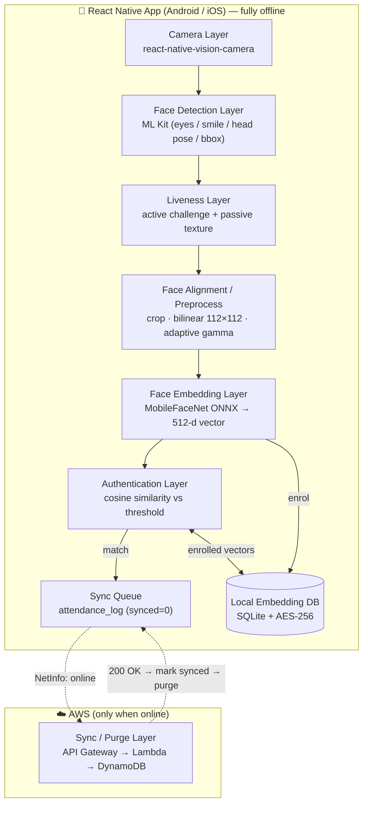
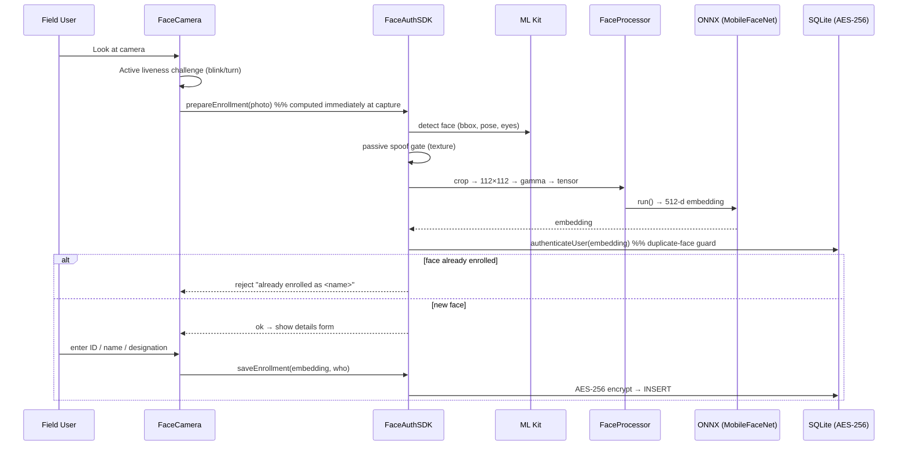
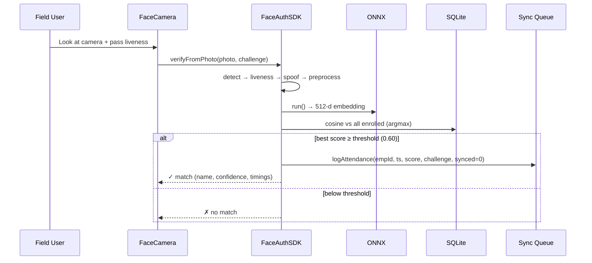
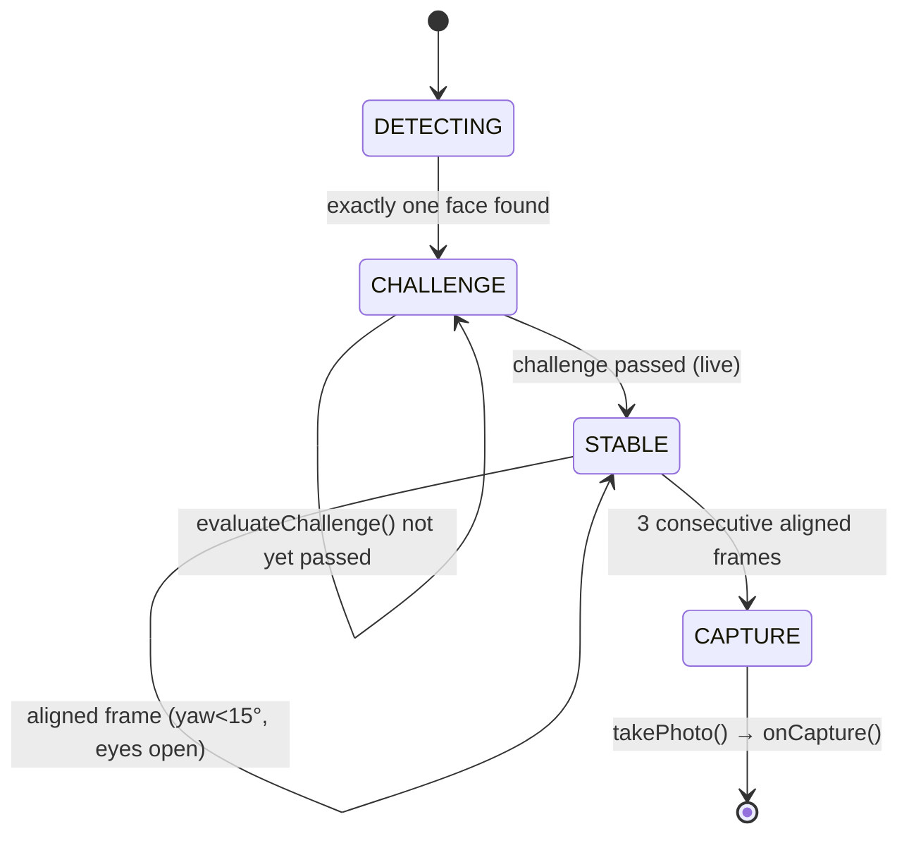
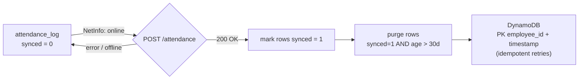

# NHAI FaceAuth — System Architecture

**Offline facial recognition + liveness detection for field personnel, built for NHAI Hackathon 7.0.**

This document is the technical reference for the evaluation committee and for engineers
integrating the module into **Datalake 3.0**. All diagrams below render on GitHub (Mermaid);
ASCII equivalents are included for paste-into-slides use.

---

## 1. Design principles

| Principle | How it is realised |
|---|---|
| **Offline-first** | Detection, embedding, matching, liveness and the auth decision run 100% on-device. The network is used *only* for opportunistic log sync. |
| **Lightweight edge AI** | A single 13.6 MB MobileFaceNet ONNX model, CPU-only inference, no GPU dependency. INT8 quantization path to ~3.5 MB. |
| **Testable core** | All decision math lives in a pure, dependency-free module (`core/faceMath.ts`) with unit tests — no native mocks required. |
| **Clean integration surface** | One façade (`FaceAuthSDK`) exposes enrol / verify / sync. Datalake 3.0 calls 3–4 methods; nothing else leaks. |
| **Defence in depth (anti-spoof)** | Active challenge–response **and** passive texture analysis, layered. |
| **Security at rest** | Embeddings AES-256 encrypted in SQLite; raw face images never persisted, never transmitted. |

---

## 2. Layered system architecture



**ASCII (for slides):**

```
            ┌──────────────── React Native App  (OFFLINE) ────────────────┐
 Camera ──► Face Detection ──► Liveness ──► Align/Preprocess ──► Embedding │
 (Vision    (ML Kit:          (active +     (crop, 112×112,     (MobileFace│
  Camera)    eyes/smile/pose)  passive)      adaptive gamma)     Net ONNX) │
                                                                      │     │
                                                                      ▼     │
                            ┌──── Local Embedding DB (SQLite + AES-256) ◄───┤
                            │                          ▲                    │
                            ▼                          │ enrolled vectors   │
                      Authentication ──(cosine ≥ thr)──┘                    │
                            │ match                                         │
                            ▼                                               │
                       Sync Queue (attendance_log, synced=0)               │
            └────────────────────────────┬──────────────────────────────-─┘
                                          │  (only when network returns)
                                          ▼
                       AWS: API Gateway → Lambda → DynamoDB
                       (200 OK ⇒ mark synced ⇒ purge old rows)
```

---

## 3. Source-code component map

```
FaceAuthApp/
├── FaceAuthSDK.ts          ← INTEGRATION FAÇADE (Datalake calls this)
│
├── core/faceMath.ts        ← PURE decision logic (unit-tested, no native deps)
│     cosineSimilarity · l2Normalize · gammaFor · spoofVerdict · evaluateChallenge
│
├── FaceProcessor.ts        ← crop → bilinear 112×112 → adaptive gamma → NCHW tensor
├── SpoofDetector.ts        ← passive texture anti-spoof (sharpness/glare/brightness)
├── Database.ts             ← SQLite; AES-256 embeddings; attendance_log; migrations
├── SyncService.ts          ← NetInfo listener → POST → mark synced → purge
│
├── context/AppContext.tsx  ← owns ONNX session, settings, live counts
├── navigation/             ← typed RootStack + bottom tabs + Enroll/Verify modals
├── screens/                ← Boot, Home, Enroll, Verify, History, Users, Settings
└── components/             ← FaceCamera (liveness capture), ui.tsx, Icon.tsx
```

**Dependency direction:** native-bound files (`FaceProcessor`, `SpoofDetector`, `Database`,
`FaceCamera`) delegate *down* to `core/faceMath.ts`. Nothing depends *up* on the UI. This keeps
the algorithmic core portable and unit-testable, and means Datalake can adopt the SDK + core
without dragging in the demo UI.

---

## 4. Enrollment flow



Key design point: the **embedding is computed at capture time**, not after the form. The
camera's temporary photo is short-lived; deferring the heavy pipeline to form-submit risked the
file being purged (and the native resizer hanging). Computing immediately mirrors the verify
path and adds a duplicate-face guard before any DB write.

---

## 5. Verification + attendance flow



---

## 6. Liveness — active challenge state machine



- A random challenge is drawn from **{BLINK, TURN_LEFT, TURN_RIGHT}** per session.
- Thresholds live in `core/faceMath.ts`:
  - **BLINK** — avg eye-open prob dips below 0.5 (closing) then rises above 0.7 (reopen). The
    band is wide because the camera polls at a few hundred ms while a blink lasts ~120 ms — we
    detect the longer *mid-blink* phase and require a reopen (a static photo can't reopen).
  - **TURN** — `|yaw| > 18°` in the prompted direction (`face.rotationY`).
- **Note on SMILE:** the implementation exists in `core/faceMath.ts` but is not in the active
  pool. ML Kit's `smilingProbability` is unreliable across demographics and lighting conditions
  in fast-poll mode, which causes frequent false negatives. BLINK + TURN provides equally strong
  anti-spoof coverage without the inconsistency.
- The reopen / re-centre requirement is what defeats **printed-photo and screen** replays.

### Passive (texture) anti-spoof — secondary gate

`spoofVerdict(sharpness, reflection, brightness)`:

```
soft   = sharpness  < 80      (variance-of-Laplacian; photos/screens are soft)
glare  = reflection > 0.05    (fraction of near-white pixels; screen/print glare)
bright = brightness > 225     (mean luminance; sunlight is legitimately bright)

isLive = NOT ( soft AND (glare OR bright) )
```

**Texture is the primary cue.** A live face has real skin micro-texture (high sharpness), so a
*sharp* frame is judged live regardless of lighting — this is the fix that stops **harsh
sunlight** (bright + specular highlights) from being misread as a spoof. Brightness/glare only
corroborate when the texture is already suspect.

---

## 7. Preprocessing pipeline (alignment layer)

```
full photo ──► ML Kit bbox ──► crop face (+10% margin) ──► adaptive gamma ──► bilinear 112×112 ──► NCHW float32 [-1,1]
```

- **Crop first, never squeeze.** The detected face region is cropped before resize; the full
  frame is never squashed to 112×112 (that destroyed accuracy in the original submission).
- **Adaptive gamma** (`gamma = ln(0.5)/ln(mean/255)`, clamped [0.4, 2.5], applied only when mean
  luminance is outside the 60–190 band) brightens shadows / tames glare for outdoor robustness.
- **Normalisation** `(x − 127.5) / 127.5` → `[-1, 1]`, channel order RGB, layout NCHW
  `1×3×112×112` — exactly matching the model's training preprocessing.

---

## 8. Model architecture & justification

| Item | Choice | Why |
|---|---|---|
| Backbone | **MobileFaceNet** (`w600k_mbf`) | Purpose-built lightweight face backbone; depthwise-separable convs; ~1M params. |
| Format | **ONNX**, run via `onnxruntime-react-native` | Cross-platform CPU inference, no GPU, single runtime for Android + iOS. |
| Input | `1×3×112×112` NCHW, RGB, `[-1,1]` | Standard ArcFace-family input. |
| Output | **512-d L2-normalised embedding** | Compact, comparable by cosine similarity. |
| Size | **13.6 MB** (FP32) → **~3.5 MB** (INT8 via `quantize_model.py`) | Well under the 20 MB cap; quantization path documented. |
| Matching | **Cosine similarity ≥ 0.60** | MobileFaceNet operating range ~0.58–0.65; tunable in Settings. |

The model is trained for face recognition (ArcFace-style margin loss on large face corpora);
identity verification is **1:N cosine matching** against locally enrolled embeddings, so adding
users needs no retraining — only a new stored vector.

---

## 9. Security architecture

```
Capture ──► (in-memory pixels only) ──► 512-d embedding ──► AES-256 encrypt ──► SQLite
   │                                                              ▲
   └── raw image discarded after embedding (never persisted)      │ key: SHA-256(secret)
                                                                   │ IV : per-record
Attendance log: employee_id + ts + score + challenge (no biometrics) ──► sync ──► purge
```

- **Embeddings encrypted at rest** (AES-256-CBC, explicit key + per-record IV — chosen so it
  works fully offline under Hermes without a native CSPRNG).
- **Raw face images are never stored and never leave the device.**
- **Only attendance metadata syncs** (IDs, timestamps, scores) — no biometric data is transmitted.
- **Production hardening (documented TODO):** derive the key from Android Keystore / iOS Secure
  Enclave and add `react-native-get-random-values` for a hardware CSPRNG.

---

## 10. Sync & purge architecture



- A `NetInfo` listener fires on `isConnected && isInternetReachable`.
- Composite key `employee_id + timestamp` makes retries **idempotent** (no duplicate uploads).
- After a confirmed 200, synced rows older than 30 days are purged locally.
- Backend is real (`aws-backend/`: Lambda + `serverless.yml` + DynamoDB) with a zero-dependency
  `mock_server.py` for offline demos.

---

## 11. Datalake 3.0 integration

```typescript
import { FaceAuthSDK } from './FaceAuthSDK';

await FaceAuthSDK.initialize(onnxSession, { threshold, spoofEnabled, onSync });
await FaceAuthSDK.enroll(imageUri, faceBounds, 'EMP-1234');          // low-level
const r = await FaceAuthSDK.authenticate(imageUri, faceBounds, 'BLINK'); // logs on success
await FaceAuthSDK.syncNow();
```

Integration footprint for Datalake: bundle the ONNX asset, mount the SDK, and call
`enroll` / `authenticate` / `syncNow`. The UI screens are reference implementations and are
optional — the SDK + `core/` are the portable unit.
